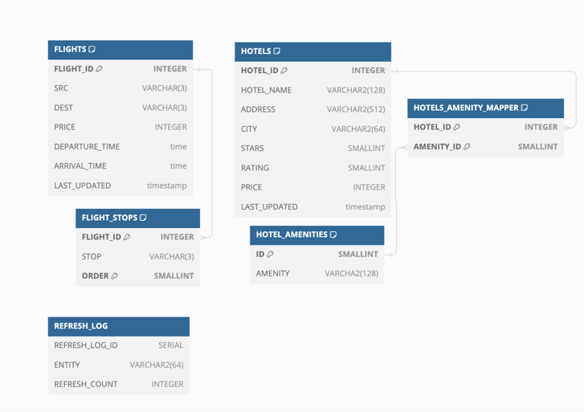

### DB Schema



[DBML File](docs/db.dbml)

### API Documentation

[Postman Collection](docs/Travelwits.postman_collection.json)

### Steps to Run

1. Clone the Repo
2. Install Docker if not already installed using instructions in [get docker](https://docs.docker.com/get-docker/) page.
3. Run the following command to start the application

   ```shell
   docker-compose up
   ```

The backend server will be running on `http://localhost:8080`

The frontend server will be running on `http://localhost:3000`

### Tech Stack

- React.js
- Material UI
- Spring Boot
- PostgreSQL
- Docker

### Features

1. User can get travel options by providing source, number of days and budget in the order of lowest cost.
2. Right now, the best score is calculated based on the cost. But it can be extended to include other factors like hotel ratings, amenities, flight stops etc.
3. Storing the data in a database to avoid calling the external API `getFlights` and `getHotels` every time.
4. Scheduled a job to update the database every 1 hour. Can be configured based on the requirement.
5. Use `CompletableFuture` with a `ThreadPool` to fetch data from external APIs in parallel, minimizing the time required for data retrieval.
6. Created the API using pagination to avoid fetching all the data at once.
7. On the frontend, implemented infinite scroll to fetch data in chunks and created a loading skeleton for better user experience.
8. Used `Docker` to containerize the application.

### Assumptions

- The departure and arrival of a flight are on the same day.
- The flight and hotels data won't go stale in the external API before 1 hour (time set for the scheduled job to update the database).
